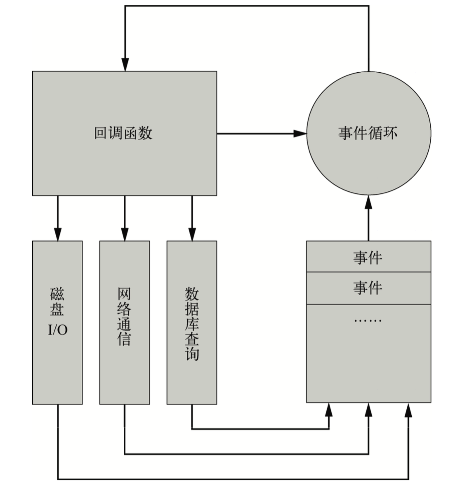

# [阻塞和非阻塞]()  
### 阻塞
* 定义：阻塞I/O的一个特点是调用之后一定要等到系统内核层面完成所有事件操作后, 调用才结束. 例如: 读取磁盘上的一段文件为例, 系统内核在完成磁盘寻道, 读取数据, 复制数据到内存中之后, 这才调用完结束. 
* 缺点：阻塞 I/O 造成 CPU 等待 I/O, 浪费等待时间, CPU 的处理能力不能得到充分利用. 
### 非阻塞
* 定义： 非阻塞和阻塞的概念相对应，指在不能立刻得到结果之前，该函数不会阻塞当前线程，而会立刻返回。
* 存在的问题：由于完整的I/O并没有完成, 立即返回的并不是业务层期望的数据, 而仅仅是当前调用的状态．
* 解决：为了获取完整的数据, 应用程序需要重复调用I/O操作来确认是否完成. 这种重复调用判断操作是否完的技术叫轮询.

# 异步IO与同步IO
### 异步IO
* 定义：当一个异步过程调用发出后，调用者不能立刻得到结果。实际处理这个调用的部件在完成后，通过状态、通知和回调来通知调用者．
* 特点：异步式 I/O就是少了多线程的开销。对操作系统来说，创建一个线程的代价是十分昂贵的， 需要给它分配内存、列入调度，同时在线程切换的时候还要执行内存换页，CPU 的缓存被 清空，切换回来的时候还要重新从内存中读取信息，破坏了数据的局部性。  
### 同步IO
* 定义：所谓同步，就是在发出一个功能调用时，在没有得到结果之前，该调用就不返回(容易导致阻塞)。

## Nodejs的事件循环机制
Node.js 程序由事件循环开始,到事件循环结束,所有的逻辑都是事件的回调函数,所以 Node.js 始终在事件循环中,程序入口就是事件循环第一个事件的回调函数。事件的回调函数在执行的过程中,可能会发出 I/O 请求或 直接发射(emit)事件,执行完毕后再返回事件循环,事件循环会检查事件队列中有没有未处理的事件,直到程序结束。

